# REVIEW OF TRADEVISTAX

## Project Overview

TradeVistaX is a modern trading and financial analytics platform designed to help users monitor market trends, analyze investments, and make informed trading decisions. The application provides a user-friendly interface, responsive design, and efficient navigation.

## Screenshots

1

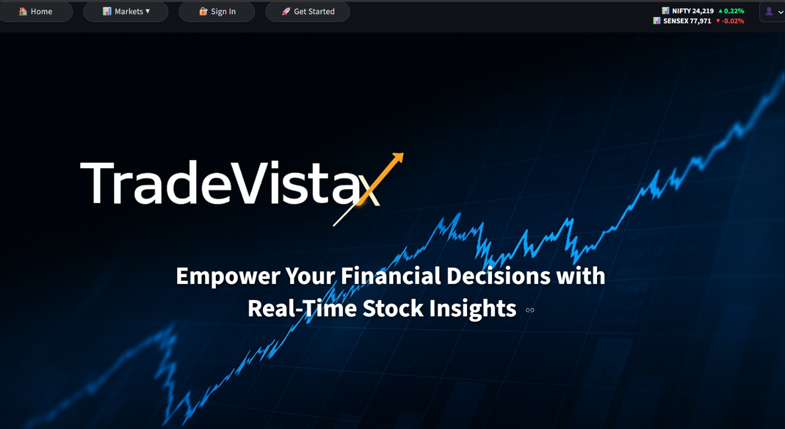

2

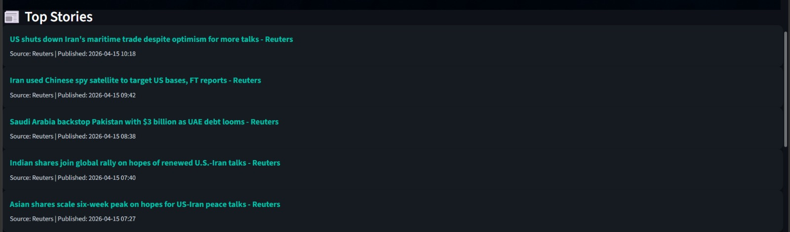

3

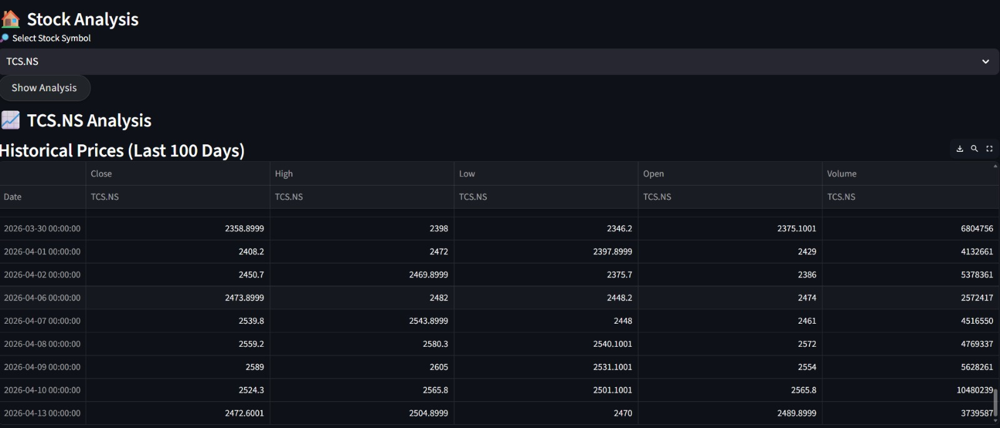

4

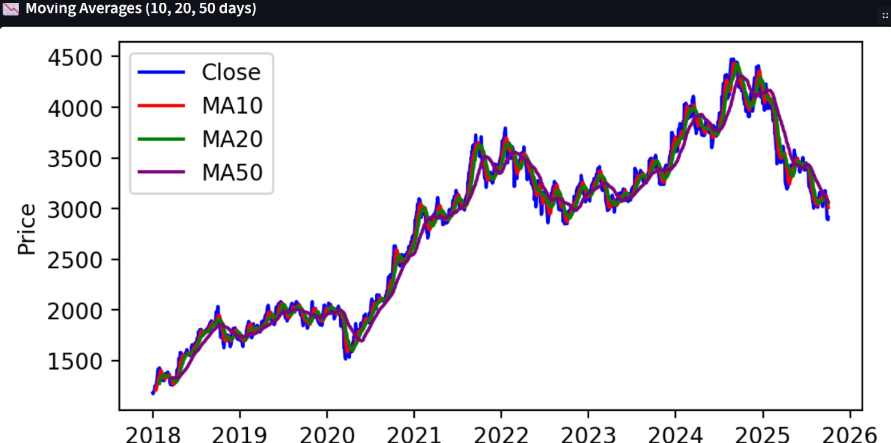

5

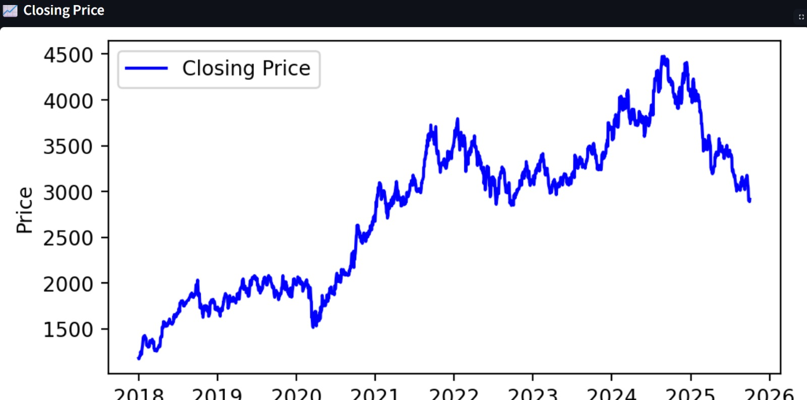

6

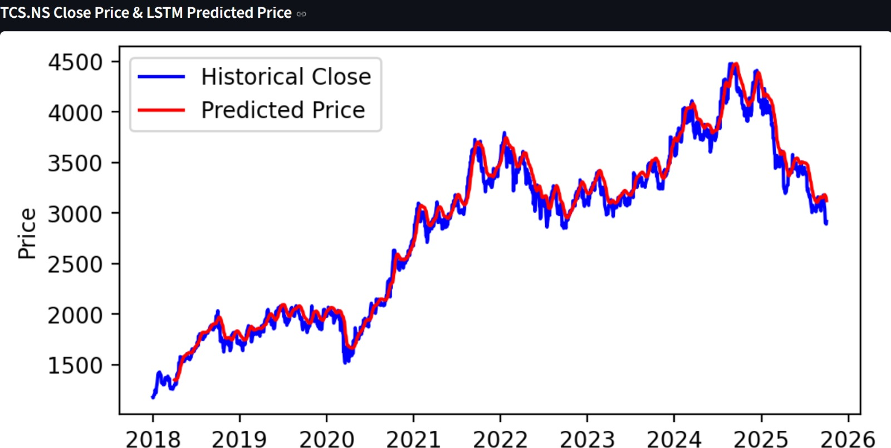

7

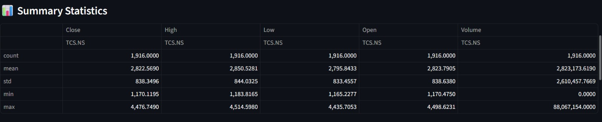

8

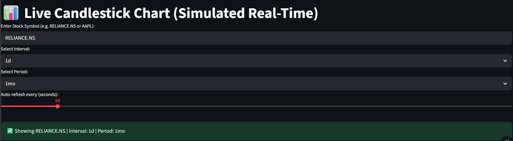

9

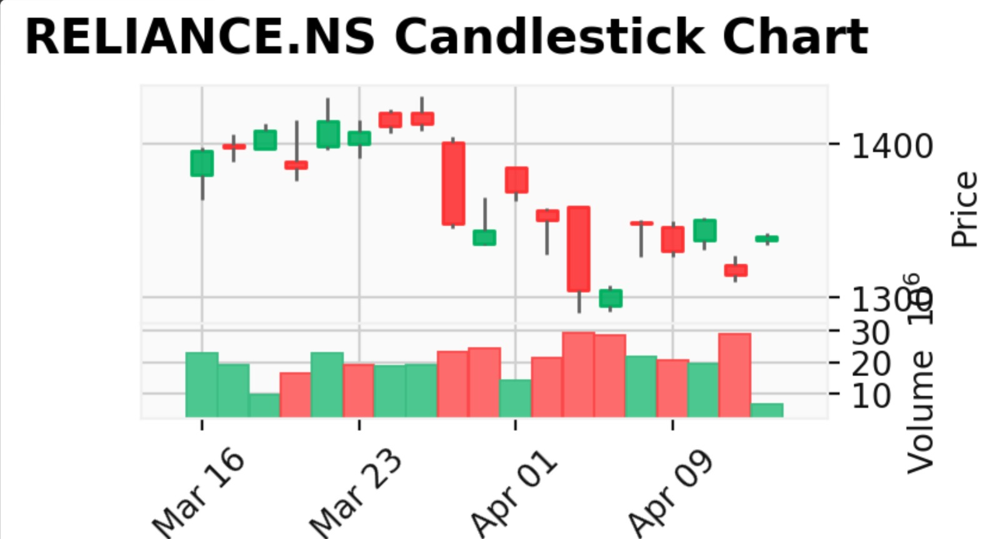

10

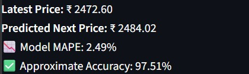

11

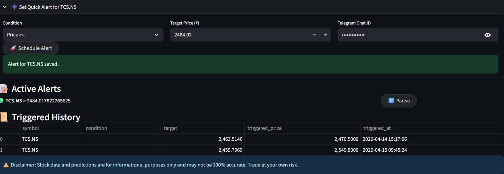

## Key Features

* Real-time market monitoring
* Trading dashboard
* Portfolio management
* Investment analytics
* User profile management
* Responsive user interface

## Strengths

* Modern and attractive design
* Easy-to-use interface
* Responsive layout
* Organized navigation
* Effective data visualization

## Areas for Improvement

* Add more advanced charting tools
* Enhance customization options
* Improve reporting capabilities
* Expand notification features

## Conclusion

TradeVistaX demonstrates a professional trading and analytics platform with a clean user interface and practical functionality. The screenshots above showcase the application's major features and user workflow. The platform provides a solid foundation for monitoring investments, analyzing market trends, and supporting informed trading decisions.
